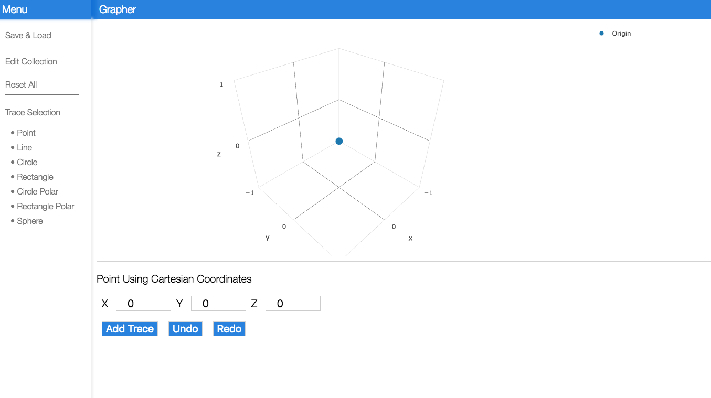
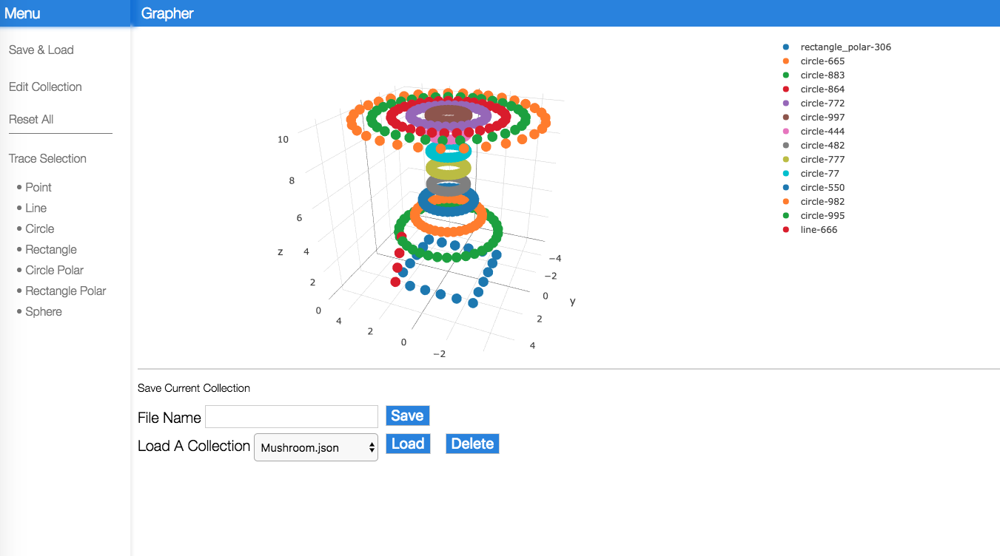
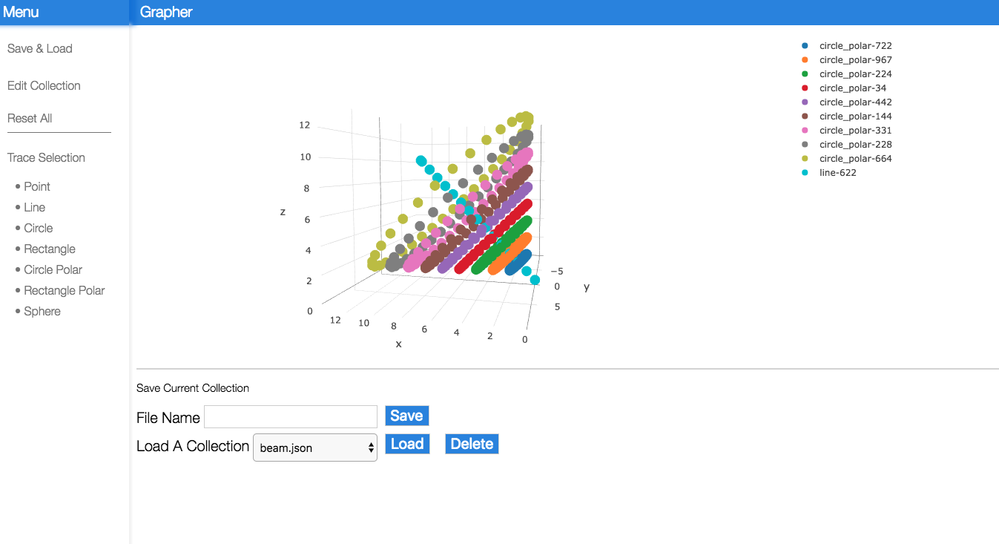

#Description

This is a basic 3d grapher application I built to test out using React, Redux, and Express together.

#TODO

- √ Save collection patterns
- √ Load Collection Patters
- √ Edit collection path
- Implement different preset paths
    - √ Point
    - √ Circle
        - Add a Polar option for circle
        - Add fill in option
    - √ Line
    - √ Rectangle
        - Combine the Polar rectangle with the 3-point  
        - Add fill in option
    - Cube (to draw a cube draw a square then simply add height (extrude))
    - Sphere

- √ Undo button
    - Undo only deletes the last edited trace, it does not undo the last edit. Change that
- √ Redo button
- √ Make my own slim down side bar, since the one I am currently using is causing a bunch of display problems
- Add Quick Save/Load animation

- √ Move trace generation to the back end
- Change the markers on the waypoint and change the color
- Download plotly library
- Integrate the bootswatch that I downloaded into the rest of the UI to make it look nice
- See if plotly will let you make a data point flash
- Fix the form enter button

- Make origin a global parameter that can be seen by all programs
    - Can get it from plotly, but should learn how to make a global parameter

#Pictures

#To run the code...
- Go to the file directory in a terminal
- go to `react-frontend` folder
- `npm start`
- In another terminal
- go to `express-backend`
- `yarn start`
